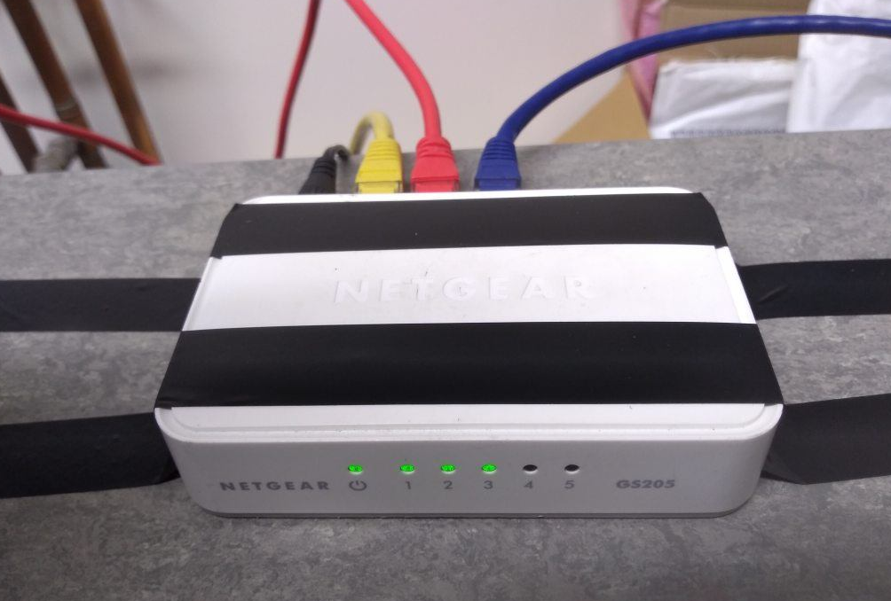
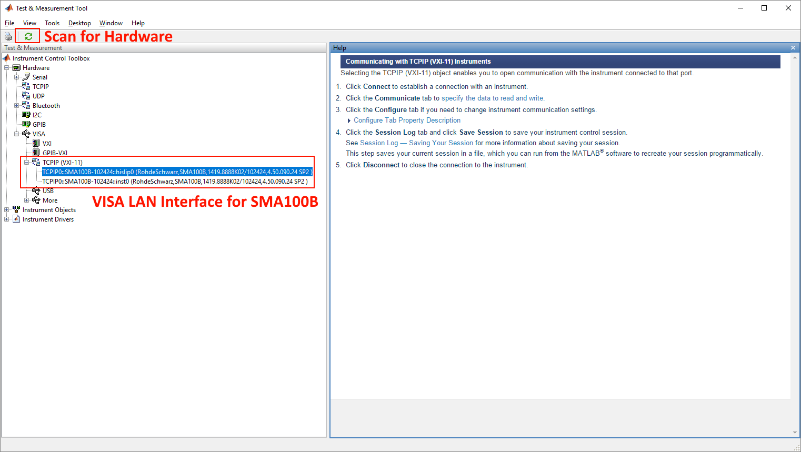

# Instrument Control for Radar Group Lab, UCL
The following are rough instructions for network based control of the Rohde & Schwarz **RTO2024 Oscilloscope** and **SMA100B Signal Generator** in the 11th floor Radar Group lab.

## General Setup
The RTO2024 Oscilloscope and SMA100B Signal Generator are both connected via Ethernet to a Netgear GS205 Switch.  It is important to ensure that the instrument(s) being used are properly connected before proceeding, and the host PC to provide the instrumentation control is also connected to the network switch



## SMA100B Signal Generator
### Connect via Web Browser
In the *System Config* menu displayed on the SMA100B screen the system IP address is displayed (for example 169.254.2.20).  Enter this into the URL bar of your web browser and the following screen will be displayed.   


Selecting *Instrument Control > Web Control* option will allow you control the instrument from your web browser as with the touch screen display on the device.


### Driver Installation
Several drivers are required to allow VISA-protocol control with the SMA100B and a Windows PC.  Find the [National Instruments VISA I/O drivers](http://www.ni.com/en-gb/support/downloads/drivers/download.ni-visa.html) and download the latest version for your system.

This is quite a lengthy install and requires that you are able to switch off Windows Fast Boot.

Next, install the [Rohde & Schwarz VXIplug&play Driver](https://www.rohde-schwarz.com/driver/sma100b/)

### MATLAB Instrumentation Control Tool
With the drivers successfully installed, reboot the system and open MATLAB.  Open the instrument control tool under *Apps > Instrument Control*.  When the tool has opened press the green 'recycle' symbol to **scan for available hardware interfaces**.

.

When the scan has completed (it may take a while), if the drivers have correctly installed and the network switch is connected to the host PC, the SMA100B interface should appear under *VISA > TCPIP (VXI-11)*.

### Control of SMA100B using MATLAB
Since we have installed the VXIplug&play driver for the SMA100B, this provides the easiest method to control the signal generator.  To begin, it may be necessary to add the driver path to the MATLAB path, which can be achieved using the following MATLAB commands.

```
% Change rssmxPath for the location of your own installation of the rssmx driver.
rssmxPath = 'C:\Program Files\IVI Foundation\VISA\Win64\rssmx';
addpath(rssmxPath);
```
It is now possible to verify the installation of the *rssmx* driver using the command

```
instrhwinfo('vxipnp','rssmx')
```

which should return a MATLAB *HardwareInfo* object containing information about the SMA100B instrument.  An object representing the device itself can then be created using

```
sma100b_IP = '169.254.2.20';
sma100b = icdevice('rssmx',['TCPIP::' sma100b_IP '::INSTR']);
```

It is now possible to connect to the SMA100B using the command

```
connect(sma100b)
```

At which point it is possible to invoke commands in the signal generator, for example enabling and disabling the output.

```
% Enable Output
invoke(sma100b, 'ConfigureOutputEnabled', 1)
% Wait for 2 seconds
pause(2)
% Disable Output
invoke(sma100b, 'ConfigureOutputEnabled', 0);
```

Finally, it is necessary to disconnect from the signal generator using

```
disconnect(sma100b);
```

A full specification of the MATLAB driver interface can be found in the driver installation directory in the file *rssmx_vxi.chm*.

## RTO2024 Oscilloscope
As with the SMA100B Signal Generator, it is necessary to install the appropriate [*rsscope* VXI](https://www.rohde-schwarz.com/uk/driver/rto/) plug and play drivers.

When the installation has completed, the same steps can be taken as for the SMA100B signal generator to verify the driver installation.  Remember to add the directory for the VXI driver to the MATLAB path using

```
% Change rssmxPath for the location of your own installation of the rsscope driver.
rsscopePath = 'C:\Program Files\IVI Foundation\VISA\Win64\rsscope';
addpath(rsscopePath);
```

The following script can be used to acquire a sinusoidal test signal.  The first steps are to determine that the drivers have been correctly installed.

```
% Signal Generator IP
rto2024IP = '169.254.233.65';

% Check Driver Installation
try
    hwobj = instrhwinfo('vxipnp','rsscope');
    rto2024 = icdevice('rsscope',['TCPIP::' rto2024IP '::INSTR']);
catch
    error('Check correct driver installation. Have you set the rssmx path?');
    quit;
end
```

Next, connect to the oscilloscope and specify some parameters for the test signal.  The time base is specified per division, of which there are ten across the screen.  The test signal should have two periods displayed across the screen of the scope.

```
% Connect to Oscilloscope
connect(rto2024);

% Specify test signal frequency
ftest = 300e6;
% Determine test signal period
ptest = 1/ftest;
% Set time base
timeBase = ptest/5;

% Set time base (2 * T)
invoke(rto2024, 'ConfigureTimeBase', timeBase, 0, 0);
```

We set the vertical scale to 50 mV/div.  The driver function argument is in volts.

```
% Set vertical scale (50 mV/div)
invoke(rto2024, 'ConfigureChannelVerticalScale', 1, 0.05);
```

Both of the previous steps are used to scale the waveform for acquisition.  In order to acquire the waveform, we first query the current sample length.

```
% Query record length
arl = invoke(rto2024, 'ActualRecordLength');
```

This ensures no additional samples are requested from the oscilloscope.  The 'ReadWaveform' handle is used to sample the current waveform. *initialX* and *xIncrement* represent the timestamp for the first sample, and the time difference between each subsequent sample.

```
% Acquire waveform
data = zeros(arl, 1);
[data, actualPoints, initialX, xIncrement] = invoke(rto2024, 'ReadWaveform', 1, 1, arl, 5000, data);
```

The next step is not crucial, however the 'ReadWaveform' function will stop continuous acquisition of data so to return to continuous monitoring of the signal the following command is necessary.

```
% Return to continuous acquisition
invoke(rto2024, 'InitiateAcquisition', 1);
```

As before, we continue to disconnect from the oscilloscope and delete the VISA object.  Then the sampled data is plotted.

```
% Disconnect from oscilloscope
disconnect(rto2024);
delete(rto2024);

% Determine time vector
t = initialX + (0:arl-1)*xIncrement;
% Plot data
plot(t, data);
grid on
```
